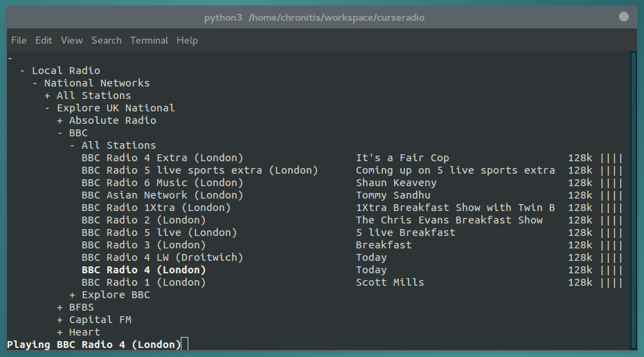

Curseradio
==========

> Internet radio in the terminal

Curseradio is a `curses` interface for browsing and playing an `OPML` directory of internet radio streams. It is designed to use the *tunein* directory found at <http://opml.radiotime.com/>, but could be adapted to others.

Audio playback uses [`mpv`](http://mpv.io/). Curseradio requires `python3` and the libraries `requests`, `xdg` and `lxml`.

Key(s) | Command
-------|--------
<kbd>↑</kbd><kbd>k</kbd>, <kbd>↓</kbd><kbd>j</kbd> | navigate
<kbd>PgUp</kbd><kbd>K</kbd>, <kbd>PgDn</kbd><kbd>J</kbd> | navigate quickly
<kbd>Home</kbd><kbd>g</kbd>, <kbd>End</kbd><kbd>G</kbd> | to top/bottom
<kbd>Enter</kbd> | open/close folders, play stream
<kbd>s</kbd> | stop playing stream
<kbd>q</kbd> | quit
<kbd>f</kbd> | toggle favourite
